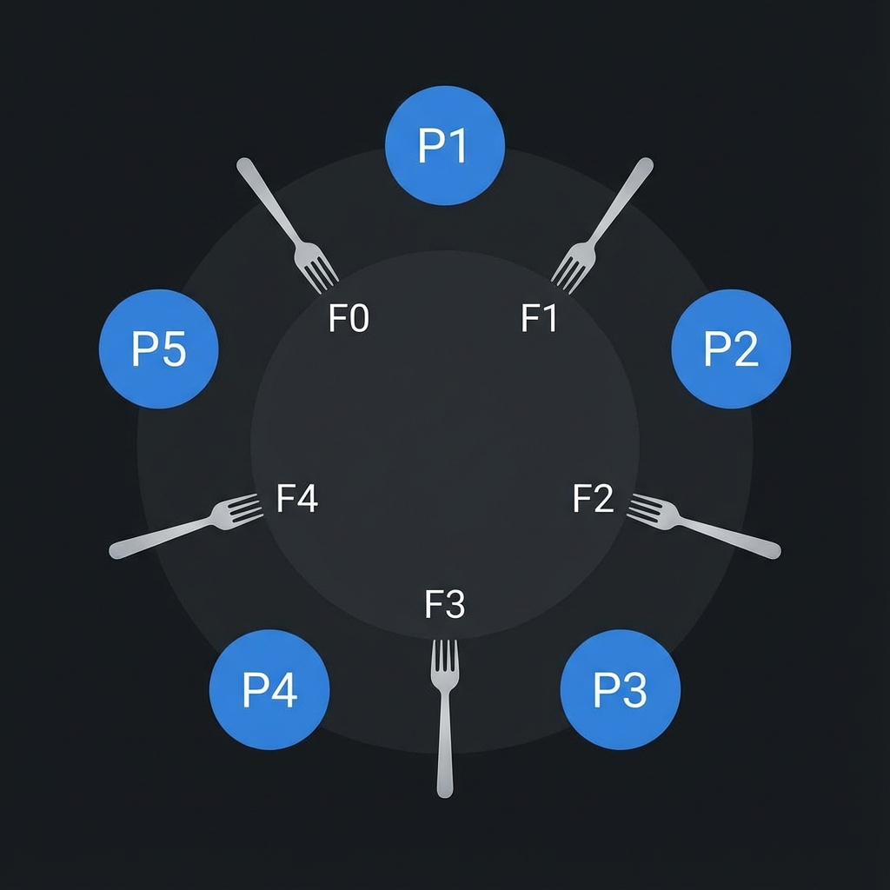

# 🍝 Dining Philosophers Problem - C# Implementation

A thread-safe implementation of the classic Dining Philosophers concurrency problem, following the [Ecole 42](https://42.fr/) project specifications.


## 📖 The Problem

Five philosophers sit at a round table with a bowl of spaghetti. A fork is placed between each pair of philosophers. To eat, a philosopher needs **both** the fork on their left and right.

The challenge: Design an algorithm where **no philosopher starves** and **no deadlock occurs**.

<p align="left">
  
</p>

## 🎯 Features

- ✅ **Deadlock Prevention** - Asymmetrical fork acquisition strategy
- ✅ **Starvation Prevention** - Fair scheduling with mandatory think delays
- ✅ **Precise Timing** - Millisecond-accurate death detection using `Stopwatch`
- ✅ **Thread-Safe Output** - Clean, synchronized console logging with colors
- ✅ **Dedicated Threads** - Native `Thread` for predictable scheduling (no ThreadPool)
- ✅ **Configurable Parameters** - All timings via command-line arguments
- ✅ **Graceful Termination** - Stops on death or meal completion
- ✅ **High Concurrency Support** - Tested with up to 200 philosophers

## 🚀 Quick Start

```bash
# Clone the repository
git clone https://github.com/duhanayan/DiningPhilosophers.git
cd DiningPhilosophers

# Build and run
dotnet run -- 5 800 200 200
```

## 📋 Usage

```bash
dotnet run -- <philosophers> <time_to_die> <time_to_eat> <time_to_sleep> [must_eat]
```

| Parameter | Description |
|-----------|-------------|
| `philosophers` | Number of philosophers (and forks) |
| `time_to_die` | Milliseconds before a philosopher dies without eating |
| `time_to_eat` | Milliseconds it takes to eat |
| `time_to_sleep` | Milliseconds spent sleeping |
| `must_eat` | (Optional) Simulation stops when all eat this many times |

### Examples

```bash
# 5 philosophers, no one should die
dotnet run -- 5 800 200 200

# 1 philosopher - will die (can't eat with only 1 fork)
dotnet run -- 1 800 200 200

# Stop after everyone eats 7 times
dotnet run -- 5 800 200 200 7

# Tight timing - should survive
dotnet run -- 4 410 200 200

# Stress test - 100 philosophers
dotnet run -- 100 800 200 200
```

## 🧪 Test Cases

### ☠️ Death Scenarios
| Test | Expected Result |
|------|-----------------|
| `1 800 200 200` | Philosopher dies (~801ms) |
| `4 310 200 100` | Philosopher dies (~310ms) |
| `4 200 205 200` | Philosopher dies (eat time > die time) |

### ✅ Completion Scenarios
| Test | Expected Result |
|------|-----------------|
| `5 800 200 200 7` | Stops after 7 meals each |
| `4 410 200 200 10` | Stops after 10 meals each |

### 💚 Survival Scenarios
| Test | Expected Result |
|------|-----------------|
| `5 800 200 200` | No one dies |
| `5 600 150 150` | No one dies |
| `4 410 200 200` | No one dies |
| `100 800 200 200` | No one dies (stress test) |

### ⚠️ Input Validation
| Test | Expected Result |
|------|-----------------|
| `-5 600 200 200` | Error: Invalid arguments |
| `4 -5 200 200` | Error: Invalid arguments |
| `4 600 200 200 -5` | Error: Invalid meal count |

## 🏗️ Architecture

```
DiningPhilosophers/
├── README.md
├── DiningPhilosophers.csproj
├── Program.cs              # Entry point & argument parsing
├── Models/
│   ├── Philosopher.cs      # Core simulation logic
│   └── Fork.cs             # Shared resource with lock
└── Utils/
    └── ConsoleHelper.cs    # Thread-safe output
```

## 💡 Key Concepts Demonstrated

- **Thread Synchronization** - `lock` statements, `ManualResetEventSlim`
- **Deadlock Prevention** - Asymmetrical resource acquisition
- **Starvation Prevention** - Fair scheduling with mandatory think delays
- **Race Condition Handling** - Thread-safe shared state
- **CancellationToken Pattern** - Graceful shutdown
- **High-Precision Timing** - `Stopwatch` + `SpinWait` for accuracy
- **Dedicated Threads** - Native `Thread` instead of `Task` for predictable scheduling

## 📚 The Solution

This implementation uses the **asymmetrical fork-picking strategy**:

- **Even** philosophers (2, 4, 6...): Pick LEFT fork first, then RIGHT
- **Odd** philosophers (1, 3, 5...): Pick RIGHT fork first, then LEFT

This breaks the circular wait condition that causes deadlock.

### Why Dedicated Threads?

Initially implemented with `Task.Run()`, but switched to native `Thread` objects for:
- **Predictable scheduling**: All philosophers start simultaneously
- **No ThreadPool contention**: Avoids delays when 100+ threads are needed
- **Better for long-running operations**: Each philosopher runs for the entire simulation

## 📄 License

MIT License - feel free to use this for learning or your portfolio!

---

*Inspired by the Ecole 42 Philosophers project*
